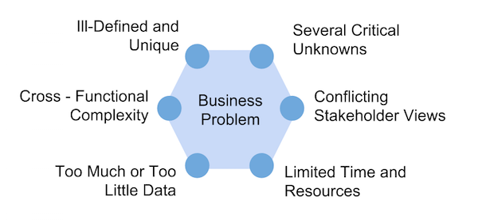

# Introduction

> “I think, therefore I am”

- What is data analysis?
- What type of questions can be answered?
- Frame/Acquire/Refine/Explore/Model/Insight framework

## Data Science as an Art

> "Science is knowledge which we understand so well that we can teach it to a computer. Everything else is art" - Donald Knuth

- We need to know the science, we need to learn the art.
- Analogous examples - Creating a hit song, Diagnosing a medical problem.
- Business problems are 'wicked in nature' - multiple stakeholder, different problem definition, different solutions, interdependence, constraints, amplifying loops

> "Data analysis is hard, and part of the problem is that few people can explain how to do it. It’s not that there aren’t any people doing data analysis on a regular basis. It’s that the people who are really good at it have yet to enlighten us about the thought process that goes on in their heads." - Roger Peng

## Types of Question

> "Doing data analysis requires quite a bit of thinking and we believe that when you’ve completed a good data analysis, you’ve spent more time thinking than doing." - Roger Peng

1. **Descriptive** - "seeks to summarize a characteristic of a set of data"
2. **Exploratory** - "analyze the data to see if there are patterns, trends, or relationships between variables" (hypothesis generating)
3. **Inferential** - "a restatement of this proposed hypothesis as a question and would be answered by analyzing a different set of data" (hypothesis testing)
4. **Predictive** - "determine the impact on one factor based on other factor in a population - to make a prediction"
5. **Causal** - "asks whether changing one factor will change another factor in a population - to establish a causal link"
6. **Mechanistic** - "establish *how* the change in one factor results in change in another factor in a population - to determine the exact mechanism"

## Hypothesis driven Approach
Hypothesis is an educated guess / hunch.

Hypothesis generation asks the question "what if"; Hypotheses testing follows it up by saying "if x, then y" with relevant data and analysis. If we keep doing this, the we can keep improving the hypothesis. It is process of "iteration and learning". Both the definition of the problem and the solution are not separate and we keep refining and reshaping and sharpening both of them

Hypothesis testing is based on abductive reasoning. When you have Induction - you start with data, working backward to form a rule...  you look at a set of data and notice when price increase, demand falls. When you have deduction, you start with rule and makes a prediction of what you will observe = when price increase, demand falls. Abduction however reasons from effect to cause - if demand is down, it might be because prices is up.
- Induction - something is operative
- Deduction - proves that something must be.
- Abductions - only suggest that something may be

Now why is abduction important - Possibility of both problem and solutions are unbounded, good hypothesis generations is critical. Because the solution is invented choice, rather than discovered truth - its contestability requires persuasive argumentation.

## Making the Case

"Making the case" is important and compelling case comes from data based hypothesis. Explaining 'what is' is an essential step in building confidence in the recommendation. Learning and changing mental models is needed for implementation and acceptance
