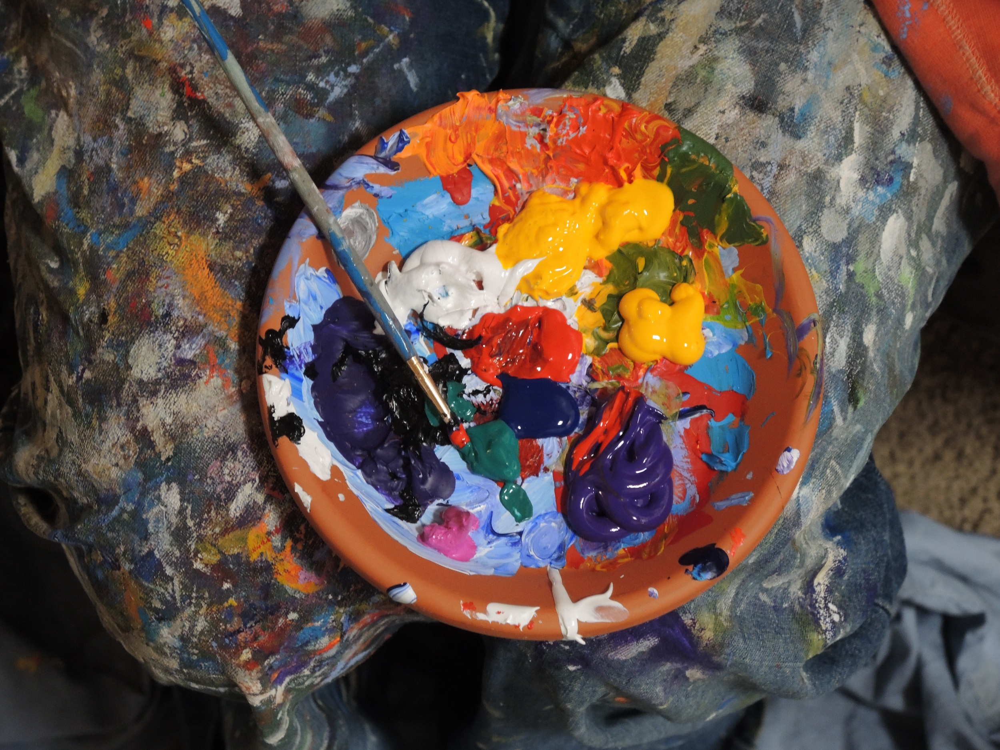
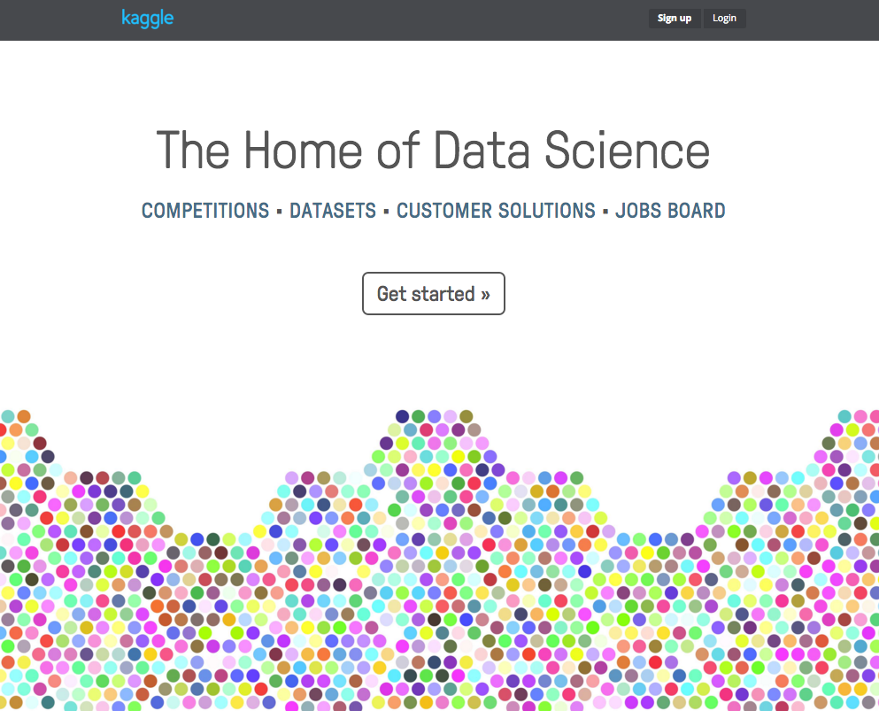

# Intro to Data Science in Python Workshop
### @unnati_xyz | @hasgeek

---

# Welcome

---

# Facilitators

---

# Amit
## @amitkaps

---

# Nischal
## @nischalhp

---

# Raghotham
## @raghothams

---

# Bargava
## @bargava

---

# Shrayas
## @shrayasr

---

# See the world through a data lens

---

# "Data is just a clue to the end truth"
-- Josh Smith

--- 

 

# Data Driven Decisions

---

# "Science is knowledge which we understand so well that we can teach it to a computer. Everything else is art" 
-- Donald Knuth

---

# Data Science is an Art

---

# Hypothesis Driven Approach

---

# Frame
## "An approximate answer to the right problem is worth a good deal"

---

# Acquire
## "80% perspiration, 10% great idea, 10% great output"

---

# Refine
## "All data is messy."

---

# Explore
## "I don't know, what I don't know."

---

# Model
## "All models are wrong, but some are useful"

---

# Insight
## "The goal is to turn data into insight"

---

---

## "Doing data analyis requires quite a bit of thinking and we believe that when you’ve completed a good data analysis, you’ve spent more time thinking than doing." 
-- Roger Peng

---

# Python Data Stack

---

# Case Studies

--- 
# Peeling the Onion

---

# Hard Disk Failure

---

# Shining Diamonds

---

# Red Wine Selection

--- 

# Kaggle Competition

---

# Learning Approach

--- 

# Do the Exercises

---

# Pair up & Learn

---

# Call for Help

--- 

# Schedule

---

## Session 0 (0830 - 0930)
- Installation

## Session 1 (0930 - 1115) 
- Overview of Data Science
- Data Science Process
- How to use Jupyter Notebook
- Intro to Data Structures in Python

--- 

## Session 2 (1135 - 1300)
- Case 1: Peeling the Onion
- Exploring Onion Price and Quantity

## Session 3 (1400 - 1530)
- Fun visualization exercise
- Communicating the Onion Insights
- Acquiring the Onion data (Web Scraping)

---

## Session 4 (1550 - 1730) 
- Case 2: Hard Disk Failure
- Explore & build intuition around Failure Rates

## Optional Advanced Session (1730 - 1830)
- Working with SQL to Acquire and Refine Hard Disk Data
- Office Hours

---

## Food and Hydration
 
### 0830 - 0930: Breakfast
### 1115 - 1135: Tea Break
### 1300 - 1400: Lunch
### 1530 - 1550: Tea Break

---

# Enjoy the workshop

---

